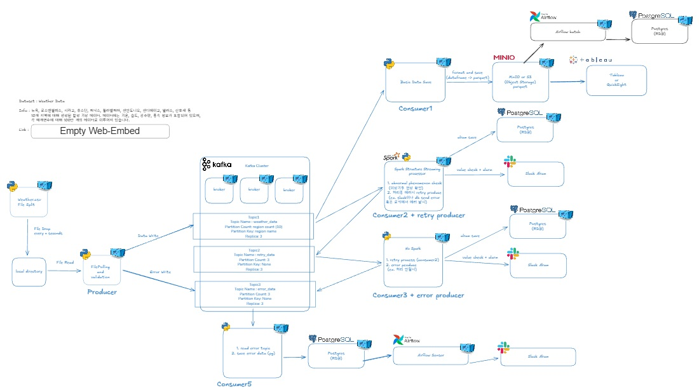

# 기상 데이터 파이프라인 - Weather Pipeline

Kafka, Spark Structured Streaming, MinIO, PostgreSQL, Airflow등을 활용한  
**End-to-End 실시간 데이터 파이프라인 프로젝트**입니다.

Synthetic weather 데이터를 생성 → 검증 → 스트리밍 처리 → 오류 처리(DLQ) →  
Slack 알림 → Parquet/PostgreSQL 저장 → (Batch ETL 진행 중) → 시각화  
까지 포함한 **실무 수준 데이터 엔지니어링 아키텍처**를 구현했습니다.

## Architecture

아래는 전체 시스템 구성도입니다.



---

## 🚀 Key Features

- Synthetic Weather Data Generator  
- Kafka 3-Broker KRaft Cluster  
- Producer 기반 파일 모니터링 + Schema Validation  
- Multi-Consumer Pipeline  
  - MinIO Consumer (Parquet)  
  - Spark Streaming Alert Consumer  
  - Retry Consumer  
  - Error Consumer (DLQ)  
- Dead Letter Queue(DLQ) 기반 에러 처리  
- Slack 알림 + 중복 방지  
- PostgreSQL 저장  
- Airflow Sensor 1시간 지속 모니터링  
- Tableau & Grafana 연동

---

## 📂 Directory Structure

```
weather-pipeline/
├── airflow/ # Airflow scheduler, webserver, DAGs, logs
│ ├── dags/
│ ├── logs/
│ └── plugins/
│
├── consumer-app-alarm/ # Spark-based streaming alert consumer
├── consumer-app-error/ # Error topic consumer → PostgreSQL 저장
├── consumer-app-minio-save/ # Parquet 저장용 consumer → MinIO 업로드
├── consumer-app-retry/ # Retry topic 재처리 consumer
│
├── create-origin-data-app/ # Synthetic weather data generator
│
├── grafana/ # Grafana container 설정
│
├── images/ # README용 아키텍처 이미지, diagrams
├── jmx/ # Kafka JMX exporter 설정
│
├── kafka/ # Kafka KRaft mode cluster configs (broker1/2/3)
├── kafka-lag-exporter/ # Kafka Lag Exporter (consumer lag 모니터링)
│
├── kaggle-data/ # 원본 Kaggle dataset
├── minio-data/ # MinIO bucket local mount
├── origin-data/ # 생성된 origin 데이터 (file drop source)
│
├── pgdata/ # PostgreSQL persistence volume
├── postgres/ # PostgreSQL schema/init scripts
│
├── producer-app/ # Kafka producer (weather, error, retry)
│
├── prometheus/ # Prometheus metrics 설정
│
├── spark-checkpoints/ # Spark Structured Streaming checkpoint
├── spark-master/ # Spark master container
├── spark-worker/ # Spark worker containers
│
├── .env-tmp # 환경 변수 파일
├── .gitignore
├── docker-compose.yml
├── README.md
└── reset.sh # 개발 환경 초기화 스크립트
```

---

## 🧩 Service Overview

### 🔵 create-origin-data-app
- Kaggle dataset 기반 synthetic weather 데이터 생성
- drop interval / row interval 기반 파일 단위 데이터 생성
- producer-app의 입력 소스 역할

---

### 🔵 producer-app
- weather-data topic 메시지 생성
- 오류(validation fail) 발생 시 → error-data topic
- retry 요청 시 → retry-data topic

---

### 🟡 Kafka (kafka/)
- Kafka 3-broker KRaft cluster 구성
- Topics:
  - weather-data (10 partitions)
  - retry-data (3 partitions)
  - error-data (1 partition)
- 지역(Location) 기반 partition key 적용

---

### 🟣 consumer-app-minio-save
- 정상 데이터(weather-data) 소비
- DataFrame 가공 → MinIO(S3 compatible) 저장 (Parquet)

---

### 🟣 consumer-app-alarm (Spark)
- Spark Structured Streaming
- schema validation, aggregation, anomaly detection
- Temperature ≥ 35°C → Slack Alert
- 중복 알림 방지(30분 cooldown)
- PostgreSQL 저장

---

### 🔴 consumer-app-error
- DLQ(error-data topic) 수집
- 에러 유형 / raw data → PostgreSQL 저장

---

### 🟤 consumer-app-retry
- retry-data topic 소비
- 재처리가 필요한 메시지 다시 weather-data에 push

---

### ⚙️ spark-master / spark-worker
- Spark Structured Streaming job 실행 환경
- cluster mode execution

---

### 📦 MinIO (minio-data/)
- Parquet 파일 저장
- Tableau/QuickSight 분석 용도

---

### 📝 Airflow (airflow/)
- Batch ETL / Daily Aggregation
- Sensor 기반 Slack Notification
- Spark job 트리거 가능

---

### 🐘 PostgreSQL (postgres/)
- 정상 데이터 저장 테이블
- 에러 로그 저장 테이블
- ETL 결과 저장

---

### 📊 Grafana / Prometheus / Kafka Lag Exporter
- consumer lag / 처리량 / broker metrics 시각화
- grafana/dashboards 디렉토리에 JSON 포함 

---

## 🔄 Data Pipeline Flow

1. create-origin-data-app이 synthetic weather 데이터를 생성한다.  
2. producer-app이 weather-data topic으로 메시지를 push한다.  
3. Kafka broker는 **Location 기반 partitioning**을 수행한다.  
4. Spark consumer-app-alarm이 실시간 validation / aggregation / anomaly detection을 처리한다.  
5. 정상 데이터 → consumer-app-minio-save → MinIO Parquet 저장  
6. 서비스 진행시 에러 → consumer-app-error → PostgreSQL 저장  
7. retry-data topic → consumer-app-retry → 재처리 후 weather-data로 재전송  
8. Airflow가 Batch ETL 및 Sensor 모니터링을 수행  
9. Tableau & Grafana에서 시각화 및 운영 모니터링

---

### ⚠️ Error Handling Strategy

```
                 ┌───────────┐
                 │  Producer │
                 │ (CSV 검증)│
                 └──────┬────┘
                        │
        Valid row ──────┘         Invalid row
 weather-data topic         error-data topic(DLQ 1차)
        │                              │
        ▼                              ▼
┌────────────────┐             ┌──────────────────────┐
│ MinIO Consumer │             │ Error Consumer       │
│ (파싱 실패 skip)│             │ → PostgreSQL 저장     │
└───────┬────────┘             └─────────┬────────────┘
        │                                  │
        ▼                                  ▼
┌────────────────┐                 Airflow Sensor
│ Spark Consumer │                 slack_sent=false 탐지
│ alert + retry  │                 Slack 알림 후 업데이트
└───────┬────────┘
        │ retry
        ▼
┌────────────────┐
│ Retry Consumer │
│ 재처리 실패 → error-data (DLQ 최종)
└────────────────┘
```